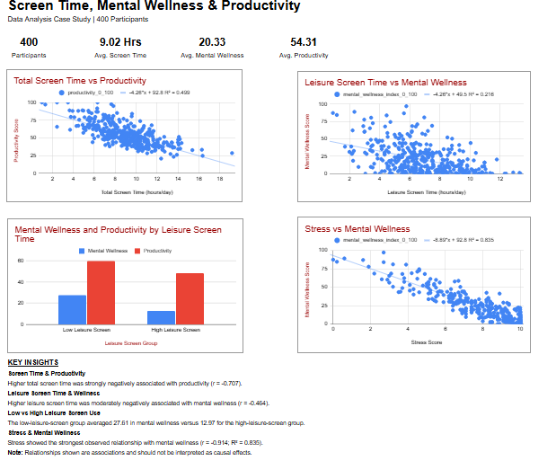

# Screen Time & Mental Wellness Analysis

## Project Overview

This data analysis project explores the relationship between screen time, mental wellness, and productivity using a dataset of **400 participants**.

The analysis focuses on whether higher screen time—particularly leisure screen time—is associated with lower mental wellness and productivity. It also explores whether exercise and social interaction are associated with better mental wellness among participants with higher screen time.

## Primary Hypothesis

**Higher screen time, particularly leisure screen time, is associated with lower mental wellness and productivity.**

## Secondary Research Question

**Among people with higher screen time, are exercise and social interaction associated with better mental wellness?**

## Dataset

The dataset contains **400 records** and includes variables related to:

* Total screen time
* Work screen time
* Leisure screen time
* Mental wellness
* Productivity
* Stress
* Exercise
* Social interaction
* Sleep hours
* Sleep quality
* Work mode
* Occupation
* Age
* Gender

### Data Quality Checks

* 400 records
* All user IDs were unique
* No missing values
* No out-of-range values
* Total screen time was verified as the sum of work and leisure screen time

## Tools Used

* **Google Sheets** — data cleaning, descriptive statistics, correlation analysis, group analysis, and dashboard creation
* **Google Docs** — case study documentation
* **Microsoft Excel format (.xlsx)** — portfolio workbook export
* **GitHub** — project documentation and portfolio hosting

## Analysis Performed

The project included:

* Data validation and quality checks
* Descriptive statistics
* Pearson correlation analysis
* Scatter plots with linear trendlines
* High vs. low leisure-screen-time comparison
* High-screen-time subgroup analysis
* Exercise and social interaction analysis
* Sleep and stress analysis
* Dashboard development

## Key Findings

### Screen Time and Mental Wellness

Total screen time showed a moderately strong negative association with mental wellness:

**r = -0.636**

Leisure screen time also showed a negative association:

**r = -0.464**

Work screen time showed a weaker negative association:

**r = -0.286**

### Screen Time and Productivity

Total screen time showed a strong negative association with productivity:

**r = -0.707**

Leisure screen time showed a moderate negative association:

**r = -0.501**

Work screen time showed a weaker negative association:

**r = -0.336**

### Low vs. High Leisure Screen Time

Participants were divided using the median leisure screen time of **6.7 hours/day**.

| Measure                 | Low Leisure Screen | High Leisure Screen |
| ----------------------- | -----------------: | ------------------: |
| Participants            |                201 |                 199 |
| Average Mental Wellness |              27.61 |               12.97 |
| Average Productivity    |              59.96 |               48.59 |

Participants in the lower-leisure-screen group had substantially higher average mental-wellness and productivity scores.

### Exercise and Social Interaction

Among the **200 high-screen-time participants**:

* Exercise had a very weak positive association with mental wellness: **r = 0.098**
* Social interaction had a very weak negative association with mental wellness: **r = -0.121**

The secondary research question was therefore **not strongly supported** by this dataset.

### Sleep and Stress

Other factors showed stronger relationships with mental wellness:

* Sleep Hours → Mental Wellness: **r = 0.581**
* Sleep Quality → Mental Wellness: **r = 0.750**
* Stress → Mental Wellness: **r = -0.914**

The linear relationship between stress and mental wellness had:

**R² = 0.835**

Stress was therefore the strongest observed correlate of mental wellness in this analysis.

## Dashboard

The dashboard summarizes the major findings using KPI indicators, scatter plots, group comparisons, and key insights.

## Conclusion

The analysis supports the primary hypothesis that higher screen time is associated with lower mental wellness and productivity in this dataset.

Leisure screen time showed stronger negative associations with both outcomes than work screen time. Participants with lower leisure screen time also had substantially higher average mental-wellness and productivity scores.

However, the analysis does **not establish causation**. Stress and sleep were also strongly associated with mental wellness and should be considered alongside screen-time behavior.

The secondary research question was not strongly supported because exercise and social interaction showed only very weak relationships with mental wellness within the high-screen-time subgroup.

## Recommendations

* Monitor discretionary leisure screen time.
* Consider stress alongside screen-time habits when evaluating mental wellness.
* Support healthy and consistent sleep habits.
* Avoid assuming that exercise or social interaction alone will offset high screen exposure.
* Distinguish necessary work-related screen use from discretionary leisure screen use.

## Limitations

* The dataset is observational, so causal conclusions cannot be made.
* Pairwise correlations do not account for all potentially relevant variables.
* Median-based group cutoffs simplify continuous variables.
* Findings may not generalize beyond this dataset.
* No intervention was conducted to test whether changing screen time or lifestyle behaviors would improve outcomes.

## Project Files

* **ScreenTime_MentalWellness_Analysis.xlsx** — complete analysis workbook and dashboard
* **ScreenTime_MentalWellness_CaseStudy.pdf** — detailed written case study
* **ScreenTime_MentalWellness_Dashboard.png** — dashboard preview
